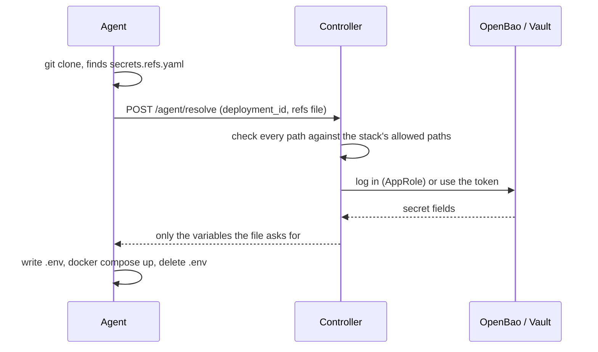

# Secret providers

Keep secrets out of Git altogether: store them in OpenBao or HashiCorp Vault, and let a Git stack's [`secrets.refs.yaml`](/guide/secrets#choosing-keys-with-secrets-refs-yaml) point at them. The file holds references, never values; the controller resolves them at deploy time with credentials it keeps itself.

```yaml
# secrets.refs.yaml — safe to commit
DB_PASSWORD: ref+vault://secret/blog/db#/password
API_KEY:     ref+sops://secrets.enc.yaml#/API_KEY
```

Providers available today:

| Scheme | Reads from | Needs a connection |
|---|---|---|
| `ref+vault://` | OpenBao or HashiCorp Vault, KV v1 or v2, token or AppRole login | yes |
| `ref+bws://` | Bitwarden Secrets Manager, with a machine account | yes, and a [tool to download](#bitwarden-secrets-manager) |
| `ref+sops://` | The stack's own `secrets.enc.yaml` | no |

## How a deploy resolves them



*The agent never talks to the secret manager and never holds its credentials; it only receives the final variables, for the length of one `docker compose up`.*

## 1. Prepare OpenBao / Vault

Wharf needs a read-only identity per stack (or one for all of them). With AppRole, on the OpenBao side:

```bash
bao policy write wharf-blog - <<'EOF'
path "secret/data/blog/*" { capabilities = ["read"] }
EOF

bao auth enable approle
bao write auth/approle/role/wharf-blog \
    token_policies=wharf-blog \
    token_ttl=1h \
    secret_id_ttl=0 \
    secret_id_num_uses=0 \
    secret_id_bound_cidrs=192.168.1.10/32   # the controller's address

bao read auth/approle/role/wharf-blog/role-id
bao write -f auth/approle/role/wharf-blog/secret-id
```

A few choices matter:

- **`secret_id_num_uses=0`.** Wharf logs in again whenever its cached token expires, so a secret ID limited to N uses stops working after N logins.
- **A long (or no) `secret_id_ttl`, rotated on a calendar.** An expired secret ID is the most common cause of a sudden failure, see [below](#errors-you-may-see).
- **A CIDR binding** limits where the secret ID is accepted.
- In a KV v2 policy the path has `data/` in it (`secret/data/blog/*`); in a Wharf reference it does not (`secret/blog/db`), Wharf adds it.

A plain token works too, but a token that expires (or isn't periodic) becomes the same kind of sudden failure.

## 2. Add a connection

**Secret providers** (admin only) lists the shared connections. A connection is an address plus, optionally, default credentials.


| Field | Meaning |
|---|---|
| Address | The server's URL, e.g. `https://openbao.example.lan:8200` |
| KV engine version | `2` (default) or `1` |
| Namespace | Optional |
| AppRole auth mount | `approle` unless you enabled it elsewhere |
| CA certificate | Only for a server signed by a private CA |
| Token, or role ID + secret ID | Default credentials, optional. Write-only: never shown again once saved |

**Test** logs in with the default credentials and tells you whether it worked.

## 3. Attach it to a stack

Open a Git stack, and under **Secret references** choose **Add OpenBao / Vault**.


There are three ways to connect:

| Mode | Address | Credentials | Use it when |
|---|---|---|---|
| A shared connection, as is | the connection's | the connection's defaults | every stack may use the same identity |
| A shared connection, with its own credentials | the connection's | this stack's | one server, a role per stack |
| A connection of its own | this stack's | this stack's | a stack talks to a different server |

Changing a shared connection's address changes it for every stack that inherits it, and their credentials are then sent to the new address; the connection page warns you.


**Allowed paths** are required when the connection has no [path rules](/guide/path-rules), one per line. When it has some, the box is titled **Extra paths (optional)**: what you type is added to the rules, it does not replace them. A path covers itself and everything below it, compared by whole segments: `secret/blog` allows `secret/blog/db`, not `secret/blogger`. A reference outside them fails the deploy without ever reaching the server. This is what separates two stacks that share the same credentials, so keep it as tight as the stack allows (`*` allows every path).

## 4. Reference the secrets

```yaml
DB_PASSWORD: ref+vault://secret/blog/db#/password
```

`secret` is the KV mount, `blog/db` the secret's path and `password` the field. The other rules (all values are references, no query string, all or nothing) are on the [Secrets](/guide/secrets#choosing-keys-with-secrets-refs-yaml) page. A reference never carries an address or credentials, so a repository can only ask for a path, never redirect Wharf to another server.

## Path rules: limit every stack at once

By default each stack lists, when you attach it, the paths it may read. A connection can instead carry **path rules**, one per line, that apply to every stack on it with no path to type stack by stack: `secret/{stack}` gives each stack its own folder, `homelab/{stack}_*` gives each one the secrets named after it in a shared project. They are checked by the controller on every deploy, so a `secrets.refs.yaml` pushed to Git cannot step outside them.

The syntax, the rules that are refused, and worked examples for OpenBao and Bitwarden are on their own page: **[Path rules](/guide/path-rules)**.

## Bitwarden Secrets Manager

References read `ref+bws://<project>/<secret key>#/value`. A Secrets Manager secret has a key, a value and a note, so the field is `value` or `note`:

```yaml
DB_PASSWORD:   ref+bws://blog/db_password#/value
SMTP_PASSWORD: ref+bws://homelab/blog_smtp#/value
```

**Bitwarden's tool is downloaded, not bundled.** Wharf reads Secrets Manager through Bitwarden's own `bws` command-line tool, whose licence does not allow redistributing it. Under **Settings → Secret providers**, the **Bitwarden tool** section shows the licence and a checkbox; once you accept, the controller downloads the pinned release from Bitwarden's release page, checks its SHA-256, and keeps it in the cache volume (`/cache`). Nothing is downloaded until you do, and the downloads of other tools are unaffected. This is not legal advice: read the licence yourself.

**Add a connection** with a machine account's access token (**Secrets Manager → Machine accounts**), and pick the region: `us` (`vault.bitwarden.com`), `eu` (`vault.bitwarden.eu`) or `custom` with a server URL. Give the machine account read access to the projects you use.

**One project per stack, or a shared one.** Both are a [path rule](/guide/path-rules):

- **A project per stack**: rule `{stack}`, and name each project after its stack (`blog`). Nothing to type when you attach a stack. This needs one project per stack, which is more than the free plan's three.
- **A shared project**: rule `homelab/{stack}_*`, and name each secret after its stack (`blog_db_password`, `blog_smtp`) inside the project `homelab`. This works on the free plan. Note that the machine account then reads the whole project, so the rule is the only thing keeping one stack from another's secrets.

Things to know:

- **Names must be unique.** Bitwarden does not enforce it. If two projects share a name, or two secrets share a key in a project, the reference fails and says so, instead of picking one.
- **A secret is one field.** Unlike OpenBao, where a path holds several, a Bitwarden secret has a single value (and a note). A project name or a secret key containing `/` cannot be referenced.
- **Cloud only for an individual.** Self-hosting Secrets Manager is limited to Bitwarden's Enterprise plan, so the controller must reach `vault.bitwarden.com` (or `.eu`). Behind a private CA, set `SSL_CERT_FILE` on the controller, as for [vulnerability scanning](/guide/vulnerability-scanning).
- **Free plan limits:** at the time of writing, three projects and three machine accounts. Check Bitwarden's current plans.
- The access token is write-only, and is passed to `bws` in its environment, never on the command line.

## Errors you may see

They appear in the deployment output and name the key that failed; every failing key is listed at once, and nothing is deployed if any fails.

| Message | Meaning |
|---|---|
| `login refused: invalid role or secret ID` | The secret ID is wrong, expired or destroyed. Replace it in the connection or in the stack's credentials, then **Test** |
| `permission denied by the OpenBao policy for …` | The role's policy doesn't cover that path |
| `no secret at …` / `field "x" not found at …` | The secret or its field doesn't exist |
| `OpenBao is sealed or not ready (503)` | Unseal it; nothing can be resolved until then |
| `cannot reach OpenBao at …` / `timed out talking to OpenBao …` | Network, address or TLS (a private CA goes in the connection) |
| `path "…" is outside the prefixes allowed for this stack` | Add the path to the stack's allowed paths, or fix the reference |
| `this stack has no vault connection` | The file uses `ref+vault://` but nothing is attached |

Polling only deploys when the branch moves, so it does not retry a failed deploy on the same commit: once the cause is fixed, use **Deploy now**.

A failing login shows up later than the change that caused it. Wharf keeps the token it got for as long as it lives (minus 30 seconds), so a secret ID destroyed at noon can keep working until the next login, then fail on a deploy at midnight. **Test** a connection right after rotating a credential.

## Good to know

- **Credentials never leave the controller.** They are stored in its isolated key store next to the other secrets, are part of an encrypted [backup](/guide/backup-restore), and are never shown again, in the UI or the audit log.
- **Redirects are not followed**, so a token can't be forwarded to another host by the server's answer.
- **Deleting** a connection that a stack still uses is refused; the message lists the stacks.
- **The audit log** records each resolution (`secrets.resolve`, or `secrets.resolve_failed`) with the variable names and which connection was used, never a value.
- **Agents must be up to date.** A stack with a secret connection is refused, with a clear message, on an agent older than 0.5.0, instead of deploying with empty variables. See [Hosts](/guide/hosts#agent-version).
