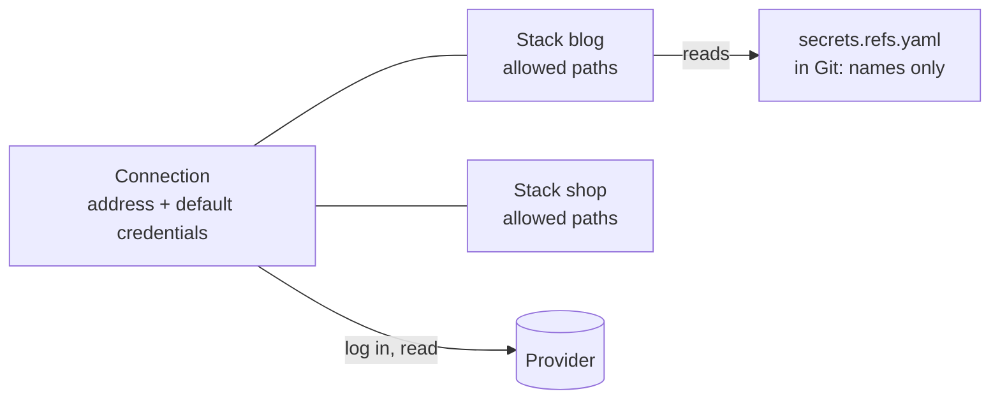

# Secret providers

A secret provider is a place your secrets live outside Git and outside Wharf: [OpenBao or HashiCorp Vault](/guide/openbao-vault), or [Bitwarden Secrets Manager](/guide/bitwarden). A Git stack's [`secrets.refs.yaml`](/guide/secret-references) points at them, and the controller reads the values at deploy time with credentials it keeps itself.

| Scheme | Reads from | Needs a connection |
|---|---|---|
| `ref+vault://` | [OpenBao or HashiCorp Vault](/guide/openbao-vault), KV v1 or v2, token or AppRole login | yes |
| `ref+bws://` | [Bitwarden Secrets Manager](/guide/bitwarden), with a machine account | yes, and a tool to download |
| `ref+sops://` | The stack's own `secrets.enc.yaml` | no |

Setting one up takes three steps, the same for every provider: add a **connection** (once), attach it to the **stacks** that may use it, and write **references**.



## 1. Add a connection

**Settings → Secret providers** (admin only) lists the shared connections. A connection is an address, optionally default credentials, and optionally [path rules](/guide/path-rules). Pick the provider under **Add a connection** and fill in its fields, listed on its own page.


The list shows each connection's address, its path rules, whether default credentials are set, and which stacks use it.

- **Credentials are write-only.** They are never shown again once saved. Editing a connection: leave the credential fields empty to keep what is stored; typing any of them replaces the whole set; **Remove the default credentials** clears them.
- **Test** checks the connection with the default credentials and tells you whether it worked: a login for OpenBao and Vault, the list of projects for Bitwarden. It does not read a secret and does not check path rules. It appears once a connection has default credentials.
- **Default credentials are optional.** Leave them empty if every stack brings its own.
- **Changing the address** of a connection changes it for every stack that inherits it, and their credentials are then sent to the new address. The connection's page warns you.
- **Deleting** a connection a stack still uses is refused; the message lists the stacks.

## 2. Attach it to a stack

Open a Git stack and, under **Secret references**, choose **Add** next to the provider. An administrator can then **Test** (with this stack's credentials), **Edit** or **Remove** it.


There are three ways to connect:

| Mode | Address | Credentials | Use it when |
|---|---|---|---|
| A shared connection, as is | the connection's | the connection's defaults | every stack may use the same identity |
| A shared connection, with its own credentials | the connection's | this stack's | one server, an identity per stack |
| A connection of its own | this stack's | this stack's | a stack talks to a different server |


### Which paths the stack may read

A reference outside the allowed paths fails the deploy **without ever reaching the provider**. This is what separates two stacks that share the same credentials, so keep it as tight as the stack allows. Two cases, depending on the connection:

- **The connection has no [path rules](/guide/path-rules).** The box is titled **Allowed paths** and is required: one path per line. A path covers itself and everything below it, compared by whole segments: `secret/blog` allows `secret/blog/db`, not `secret/blogger`. A lone `*` allows every path.
- **The connection has path rules.** The rules already give the stack its paths, shown above the box. It is then titled **Extra paths (optional)**: what you type is *added* to the rules, it does not replace them, and a lone `*` is refused.


Path rules are the way to avoid typing a path stack by stack: `secret/{stack}` gives every stack its own folder. They have [their own page](/guide/path-rules).

## 3. Reference the secrets

```yaml
DB_PASSWORD: ref+vault://secret/blog/db#/password
```

The syntax, `{stack}`, and the rules of the file are on the [Secret references](/guide/secret-references) page.

## Good to know

- **Credentials never leave the controller.** They are stored in its isolated key store next to the other secrets, are part of an encrypted [backup](/guide/backup-restore), and are never shown again, in the UI or the audit log.
- **The agent never sees them.** It receives only the final variables, for the length of one deploy.
- **The audit log** records `secrets.connection_create`, `…_update` and `…_delete`, `secrets.binding_set` and `…_remove`, `secrets.tool_install` (the Bitwarden tool), and each resolution, with names and never a value.
- **Agents must be up to date.** A stack with a secret connection is refused on an agent older than 0.5.0, see [Hosts](/guide/hosts#agent-version).
- **The controller must reach the provider.** A `dns error` or a timeout in a deploy is the controller's network (DNS, firewall, proxy), not the provider.
