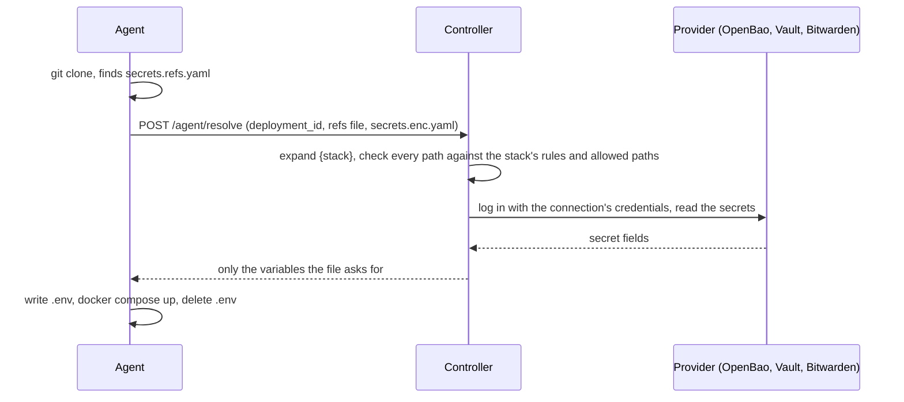

# Secret references

A Git stack can keep its secrets out of Git altogether. Put a `secrets.refs.yaml` next to the compose file: it lists the variables the stack gets, and for each one *where to read it*, never its value. The file holds no secret, so it is safe to commit.

```yaml
# secrets.refs.yaml
DB_PASSWORD:   ref+vault://secret/blog/db#/password
SMTP_PASSWORD: ref+bws://homelab/blog_smtp#/value
API_KEY:       ref+sops://secrets.enc.yaml#/API_KEY
```

It is optional and for Git stacks only. Without it, every key of `secrets.enc.yaml` becomes a variable, as described on the [Secrets](/guide/secrets) page.

## Writing a reference

A reference reads `ref+<scheme>://<path>#/<field>`.

| Scheme | Reads from | Path | Field |
|---|---|---|---|
| `sops` | The stack's own `secrets.enc.yaml` (either format) | Always `secrets.enc.yaml` | The key in that file |
| `vault` | [OpenBao or HashiCorp Vault](/guide/openbao-vault) | `<mount>/<secret path>` | A field of the secret |
| `bws` | [Bitwarden Secrets Manager](/guide/bitwarden) | `<project>/<secret key>` | `value` or `note` |

`vault` and `bws` go through a [connection](/guide/secret-providers) an administrator sets up once and attaches to the stack. Any other scheme fails the deploy with a clear message.

A reference never carries an address or credentials, so a repository can only ask for a path, never redirect Wharf to another server.

### The name on the left

The left side is the variable your compose file sees. It can differ from the secret's own name (`DB_PW` in the provider can become `DB_PASSWORD` here), but it has to be the name the compose file reads:

```yaml
# compose file
environment:
  - DB_PASSWORD=${DB_PASSWORD}
```

If the two differ, Compose does not fail. It prints `The "DB_PASSWORD" variable is not set` in the deployment output and starts the container with an empty value; the application complains later. See [Using a secret in your compose file](/guide/secrets#using-a-secret-in-your-compose-file).

### One file for several stacks

Write `{stack}` in the path of a reference and the controller puts the id of the stack that deploys in its place. The same repository can then serve a stack on each server, each reading its own secrets:

```yaml
# the same secrets.refs.yaml for the stacks "dnsweaver-1" and "dnsweaver-2"
PIHOLE_TOKEN: ref+bws://homelab/{stack}_PIHOLE#/value
SOPHOS_TOKEN: ref+bws://homelab/{stack}_SOPHOS#/value
```

`dnsweaver-1` reads `homelab/dnsweaver-1_PIHOLE` and `dnsweaver-2` reads `homelab/dnsweaver-2_PIHOLE`.

- It is only a way of not writing the id. The [path rules](/guide/path-rules) and the allowed paths are checked on the path that results, so a stack still cannot read what is not its own.
- An error shows the real path (`homelab/dnsweaver-2_PIHOLE`), the one to look for in the provider.
- It works in the **path** only, not after `#/`, and it is the only thing allowed between braces: `{name}` or a stray brace is refused when the file is read.
- The id is the one in the stack's address. It does not change when you rename the stack.

## The rules are strict on purpose

- **The file is the only source.** With a `secrets.refs.yaml`, keys of `secrets.enc.yaml` that no reference picks up are not deployed. The deployment output names them (never their values), so a forgotten one is easy to spot.
- **Every value must be a reference.** A literal such as `PASSWORD: hunter2` is refused, and so is a query string (`?address=…`).
- **All or nothing.** If any reference cannot be resolved, nothing is deployed, and the error lists every failing key.
- **No file, no change.** A stack without `secrets.refs.yaml` behaves exactly as before.

## How a deploy resolves them



*The agent never talks to the secret manager and never holds its credentials. It only receives the final variables, for the length of one `docker compose up`.*

::: warning Update your agents first
An agent older than 0.5.0 ignores `secrets.refs.yaml` and would start the stack with empty variables. A stack with a [secret provider](/guide/secret-providers) attached is therefore refused on such an agent, with a clear message, instead of deploying. Update the agent first (see [Hosts](/guide/hosts#agent-version)).
:::

## When a deploy fails

The deployment output names every failing key, and nothing is deployed if any fails:

```
resolve secrets.refs.yaml: controller refused (422): 2 reference(s) could not be resolved:
  DB_PASSWORD (vault://): no secret at secret/blog/db
  SMTP_PASSWORD (bws://): path "homelab/shop_smtp" is outside the prefixes allowed for this stack (rule homelab/blog_*)
```

| Message | What to do |
|---|---|
| `invalid secrets.refs.yaml:` followed by a key | The file itself is wrong: a literal value, a bad key name, a key twice, a query string, or braces other than `{stack}` |
| `no provider for "x" is available` | The scheme is not one of `sops`, `vault`, `bws` |
| `this stack has no vault connection` (or `bws`) | Nothing is attached. Add the provider under **Secret references** on the stack's page |
| `path "…" is outside the prefixes allowed for this stack` | The reference is outside the connection's [path rules](/guide/path-rules) and the stack's allowed paths. Fix the reference, or ask an administrator to allow the path |
| `{stack} cannot be used: the stack id … is not a plain id` | The stack's id is not a lowercase id. It cannot be put in a path |
| `secrets.enc.yaml was not found next to the compose file` | A `ref+sops://` reference needs the file in the repository |
| Anything else | The provider's own message: see [OpenBao / Vault](/guide/openbao-vault#errors-you-may-see) or [Bitwarden](/guide/bitwarden#errors-you-may-see) |

Polling only deploys when the branch moves, so it does not retry a failed deploy on the same commit. Once the cause is fixed, use **Deploy now**.

## Good to know

- **The audit log** records each resolution (`secrets.resolve`, or `secrets.resolve_failed`) with the variable names and which connection was used, never a value.
- **Masking.** A value that came from a provider is masked in the UI like any other secret, see [Masking in the UI](/guide/secrets#masking-in-the-ui).
