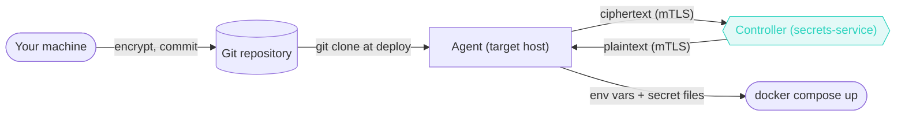
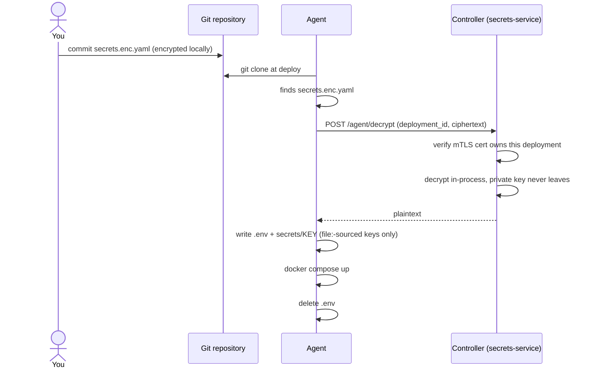

# Secrets

Every stack gets its own [age](https://age-encryption.org) keypair. The public key is shown on the stack's page and is safe to share anywhere; the private key is generated and held by the controller's secrets custodian and never leaves it — not even to display.

## Local stacks

Paste a `KEY=value` block into the stack's form, one secret per line:

```
DB_PASSWORD=a-real-generated-password
API_TOKEN=sk-live-...
```

Wharf encrypts it before anything touches disk, and never shows the values again once saved.

**Saving replaces the whole block**, not individual lines. Use **Remove all secrets** to clear them entirely. Either way, a change only takes effect on the next deploy — a running deployment keeps what it already has.

## Git stacks

Encrypt a plain `secrets.yaml` to the stack's public key, and commit the result as `secrets.enc.yaml` next to the compose file:

```yaml
# secrets.yaml — never committed, only its encrypted output is
DB_PASSWORD: a-real-generated-password
API_TOKEN: sk-live-...
```

::: code-group

```bash [age]
age -r <public key> -o secrets.enc.yaml secrets.yaml
```

```bash [sops]
sops -e --age <public key> secrets.yaml > secrets.enc.yaml
```

:::

Wharf detects the format automatically. At deploy time, the agent finds `secrets.enc.yaml` right after cloning but can't read it — only the controller holds the private key. So the ciphertext goes to the controller over the agent's existing connection, and only the resulting plaintext comes back:



*A Git stack's secrets never make the controller hold the ciphertext ahead of time — the agent finds it after cloning, and only the ciphertext (never the key) crosses the network to get decrypted.*

Same flow, one level of detail down — this is the part that actually stops an agent from decrypting anything it hasn't earned:



*`POST /agent/decrypt` is scoped to one `deployment_id`, checked against the calling agent's own mTLS certificate — an agent can't decrypt another host's secrets by guessing or replaying a request, only the one ciphertext it just cloned for the deployment it's actually running.*

::: warning Windows line endings will break this
If your editor/OS/Git config rewrites the file's line endings (`autocrlf` is the usual culprit), decryption fails with a clear error. Mark the file as binary in `.gitattributes` before committing, then re-encrypt and re-commit:

```
secrets.enc.yaml -text
```
:::

## Using a secret in your compose file

Whether a secret came from the form (local stack) or `secrets.enc.yaml` (Git stack), referencing it works the same way. Use `${KEY}` for a plain environment variable, or give the image a file instead, for anything that expects one:

```yaml
secrets:
  api_password:
    file: ./secrets/API_PASSWORD   # written by Wharf at deploy time

services:
  app:
    image: ghcr.io/example/app:1.4.0
    secrets:
      - api_password
    environment:
      API_PASSWORD_FILE: /run/secrets/api_password
```

Compose's own `environment:`-sourced `secrets:` works too, and can be mixed freely with the `_FILE` convention on the container side:

```yaml
secrets:
  api_password:
    environment: API_PASSWORD   # reads it from the .env Wharf writes for the deploy

services:
  app:
    image: ghcr.io/example/app:1.4.0
    secrets:
      - api_password
    environment:
      API_PASSWORD_FILE: /run/secrets/api_password
```

The top-level `secrets:` block's `file:`/`environment:` only controls where **Compose** gets the value from — never how the **container** receives it. Any container listing a secret under its own `secrets:` always gets it the same way, as a file at `/run/secrets/<name>`, regardless of which source form produced it. (Want a real environment variable inside the container instead of a file? Skip the `secrets:` mechanism entirely and use plain `${KEY}` substitution, as above.)

On disk, the two forms aren't equivalent: `file:` needs its `secrets/<KEY>` file to persist for as long as the container might restart, so Wharf keeps it — one file per key actually referenced this way, nothing for a key that isn't. `environment:` only needs the value in `.env` for the moment `docker compose up` runs; Wharf deletes that file right after, and the container keeps working fine. So `environment:` is the one that leaves nothing behind on the host once the deploy finishes.

::: tip
`file:` also needs the agent's stacks directory bind-mounted at a matching host/container path, which the [Hosts](/guide/hosts#add-an-agent) page's install command already sets up correctly. `environment:` has no such requirement — it doesn't touch a host bind mount at all.
:::

## Masking in the UI

On a container's detail page, secret-sourced values are masked automatically: for a local stack, any value matching one of the stack's decrypted secrets; for a Git stack (whose secrets the controller never holds centrally), any value the compose file set via `${...}`/`$VAR` substitution. A literal value like `TZ: 'America/Toronto'` still shows in plain text.
