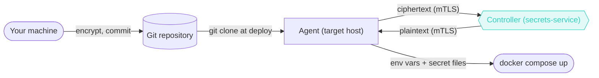
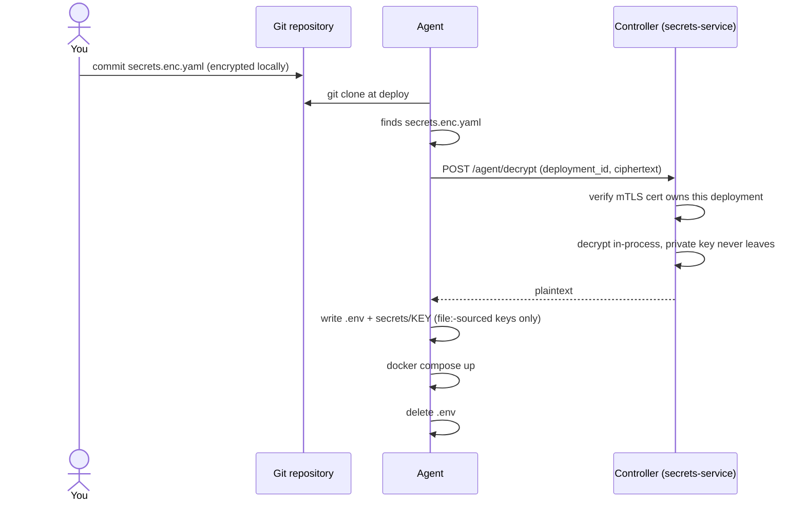

# Secrets

Wharf hands a stack's secrets to `docker compose up` as variables (and as files, if you ask for them), for the length of one deploy. Where the values *live* is your choice:

| Source | For | Where the values are | Choose it when |
|---|---|---|---|
| **A form** on the stack's page | Local stacks | Encrypted on the controller | You write the compose file in Wharf |
| **`secrets.enc.yaml`**, committed next to the compose file | Git stacks | In Git, encrypted to the stack's key | You want nothing but Git and Wharf |
| **`secrets.refs.yaml`** with [references](/guide/secret-references) | Git stacks | In OpenBao, Vault or Bitwarden; Git only holds names | Secrets must never be in Git, or are shared and rotated elsewhere |

The first two are on this page. The third is a [file of references](/guide/secret-references) resolved by [secret providers](/guide/secret-providers), and can also point at `secrets.enc.yaml`, so the two mix.

Every stack gets its own [age](https://age-encryption.org) keypair. The public key is shown on the stack's page and is safe to share anywhere; the private key is generated and held by the controller's secrets custodian and never leaves it, not even to display.

## Local stacks

Paste a `KEY=value` block into the stack's form, one secret per line:

```
DB_PASSWORD=a-real-generated-password
API_TOKEN=sk-live-...
```

Wharf encrypts it before anything touches disk, and never shows the values again once saved.

**Saving replaces the whole block**, not individual lines. Use **Remove all secrets** to clear them entirely. Either way, a change only takes effect on the next deploy; a running deployment keeps what it already has.

## Git stacks: the encrypted file

Encrypt a plain `secrets.yaml` to the stack's public key, and commit the result as `secrets.enc.yaml` next to the compose file:

```yaml
# secrets.yaml — never committed, only its encrypted output is
DB_PASSWORD: a-real-generated-password
API_TOKEN: sk-live-...
```

::: code-group

```bash [age]
age -r <public key> -o secrets.enc.yaml secrets.yaml
```

```bash [sops]
sops -e --age <public key> secrets.yaml > secrets.enc.yaml
```

:::

No `age` or `sops` installed locally? **Tools → Encrypt secrets** (admin only) does the same thing in the browser: paste or upload the plaintext, pick the stack from a dropdown (or paste a public key directly), choose plain age or SOPS, and copy or download the result. Nothing typed there is ever stored on the controller; it is the same one-shot operation as the commands above. SOPS output comes from the real `sops` binary, so it is identical to what the command line would produce. The link **Encrypt it here instead**, on a stack's page, opens it with that stack's public key already filled in.


Every key of the file becomes a variable of the stack. To choose which ones, rename them, or take some from a secret manager instead, add a [`secrets.refs.yaml`](/guide/secret-references).

### How it is decrypted

Wharf detects the format automatically. At deploy time the agent finds `secrets.enc.yaml` right after cloning but cannot read it: only the controller holds the private key. So the ciphertext goes to the controller over the agent's existing connection, and only the resulting plaintext comes back:


```mermaid
flowchart LR
    You(["Your machine"])
    Repo[("Git repository")]
    Agent["Agent (target host)"]
    Controller{{"Controller (secrets-service)"}}
    Deploy(["docker compose up"])

    You -- "encrypt, commit" --> Repo
    Repo -- "git clone at deploy" --> Agent
    Agent -- "ciphertext (mTLS)" --> Controller
    Controller -- "plaintext (mTLS)" --> Agent
    Agent -- "env vars + secret files" --> Deploy

    classDef accent fill:#2dd4bf22,stroke:#2dd4bf,color:#2dd4bf;
    class Controller accent;
```

*The controller never holds a Git stack's ciphertext ahead of time. The agent finds it after cloning, and only the ciphertext (never the key) crosses the network to get decrypted.*

One level of detail down, this is the part that stops an agent from decrypting anything it has not earned:


```mermaid
sequenceDiagram
    actor U as You
    participant G as Git repository
    participant A as Agent
    participant C as Controller (secrets-service)

    U->>G: commit secrets.enc.yaml (encrypted locally)
    A->>G: git clone at deploy
    A->>A: finds secrets.enc.yaml
    A->>C: POST /agent/decrypt (deployment_id, ciphertext)
    C->>C: verify mTLS cert owns this deployment
    C->>C: decrypt in-process, private key never leaves
    C-->>A: plaintext
    A->>A: write .env + secrets/KEY (file:-sourced keys only)
    A->>A: docker compose up
    A->>A: delete .env
```

*`POST /agent/decrypt` is scoped to one `deployment_id`, checked against the calling agent's own mTLS certificate. An agent cannot decrypt another host's secrets by guessing or replaying a request, only the one ciphertext it just cloned for the deployment it is running.*

::: warning Windows line endings will break this
If your editor, OS or Git config rewrites the file's line endings (`autocrlf` is the usual culprit), decryption fails with a clear error. Mark the file as binary in `.gitattributes` before committing, then re-encrypt and re-commit:

```
secrets.enc.yaml -text
```
:::

## Using a secret in your compose file

Whatever the source (the form, `secrets.enc.yaml`, or a reference), a secret reaches your compose file the same way. Use `${KEY}` for a plain environment variable, or give the container a file, for anything that expects one:

```yaml
secrets:
  api_password:
    file: ./secrets/API_PASSWORD   # written by Wharf at deploy time

services:
  app:
    image: ghcr.io/example/app:1.4.0
    secrets:
      - api_password
    environment:
      API_PASSWORD_FILE: /run/secrets/api_password
```

Compose's own `environment:`-sourced `secrets:` works too, and mixes freely with the `_FILE` convention on the container side:

```yaml
secrets:
  api_password:
    environment: API_PASSWORD   # reads it from the .env Wharf writes for the deploy

services:
  app:
    image: ghcr.io/example/app:1.4.0
    secrets:
      - api_password
    environment:
      API_PASSWORD_FILE: /run/secrets/api_password
```

The top-level `secrets:` block's `file:` or `environment:` only says where **Compose** gets the value from, never how the **container** receives it. A container that lists a secret under its own `secrets:` always gets it as a file at `/run/secrets/<name>`. Want a real environment variable inside the container instead? Skip the `secrets:` mechanism and use `${KEY}` as in the first sentence.

On disk, the two forms differ. `file:` needs its `secrets/<KEY>` file to last as long as the container might restart, so Wharf keeps it: one file per key actually used that way, nothing for a key that is not. `environment:` only needs the value in `.env` while `docker compose up` runs; Wharf deletes that file right after, and the container keeps working. So `environment:` is the one that leaves nothing behind on the host.

::: tip
`file:` also needs the agent's stacks directory bind-mounted at a matching host and container path, which the install command on the [Hosts](/guide/hosts#add-an-agent) page already sets up. `environment:` has no such requirement.
:::

::: warning The name must match
Compose reads `${DB_PASSWORD}` from a variable called `DB_PASSWORD`. If no key has that name, Compose does not fail: it prints `The "DB_PASSWORD" variable is not set` in the deployment output and starts the container with an empty value, and the application complains later. With [references](/guide/secret-references#the-name-on-the-left), the name on the left of each line is the one to match.
:::

## Masking in the UI

On a container's detail page, secret-sourced values are masked automatically. For a local stack, any value matching one of the stack's decrypted secrets is masked. For a Git stack (whose secrets the controller never holds centrally), any value the compose file set through `${...}` or `$VAR` substitution is. A literal value such as `TZ: 'America/Toronto'` still shows in plain text.
