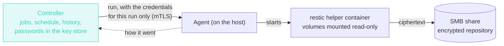

# Volume backups

Wharf can copy the named Docker volumes of a host to a SMB (CIFS) share on a schedule or on demand, and restore them. The copies go into an encrypted, deduplicated [restic](https://restic.net) repository, so the share only ever holds ciphertext, a second copy of an unchanged volume costs almost nothing, and old snapshots can be thinned out by a retention rule.

| | |
|---|---|
| **What is backed up** | Named Docker volumes, one snapshot per volume. Not bind mounts, not anonymous volumes, not compose files |
| **Where to** | A SMB share (NAS, Windows or Samba file server) |
| **How it is stored** | One restic repository per host and destination, encrypted with a password Wharf generates |
| **When** | A cron schedule, or **Back up now** |
| **Consistency** | Copy while the containers run, or stop the containers that use the volumes for the copy |
| **Restore** | Into a **new** volume, never over the original |

It needs [agent](/guide/hosts) 0.9.0 or later on the host that owns the volumes.


## In five steps

1. On your file server, [prepare a share](#prepare-the-share) and a user for the backups.
2. **Settings → Backup destinations → Add a destination**, and **save the repository password** Wharf shows once.
3. **Backups → New job**: pick the host, tick the stacks or volumes (or give a label), set a schedule and how to treat the containers.
4. On the job's page, **Initialize the repository** (once per host), then **Back up now**.
5. Look at the run, and try a **Restore…** into a new volume once, so you know it works before you need it.

## How it works



*The controller never touches the data: the volumes are read on their own host, and the bytes go from there to the share.*

For each run, the agent has Docker mount the share as a temporary volume, starts the official `restic/restic` image with your volumes mounted read-only next to it, and removes the temporary volume at the end. The share's password is therefore known to the agent only for the length of a run, and nothing restic-related runs inside the controller.

## Prepare the share

Wharf writes to the share with one user, so give it a share of its own and a user that can do nothing else.

- **On a NAS** (Synology, TrueNAS, QNAP…): create a user such as `wharf-backup`, a shared folder such as `backups`, give only that user read and write on it, and make sure SMB 2 or 3 is enabled. SMB 1 is not supported.
- **On Windows**: a shared folder, with the user's rights granted both on the share and on the folder.
- **On Linux with Samba**, the whole of what is needed in `smb.conf`:

```ini
[global]
   workgroup = WORKGROUP
   security = user
   map to guest = never
   server min protocol = SMB2

[backups]
   path = /srv/backups
   read only = no
   valid users = wharf-backup
```

Then add the user with `smbpasswd -a wharf-backup`.

Check it from the host that will run the backups before going further (`smbclient` is in the `smbclient` package of most distributions):

```bash
smbclient //nas.example.lan/backups -U wharf-backup -c ls
```

The host also needs the `cifs` kernel module, which most Linux distributions include, and must be able to reach the file server by the name or address you give Wharf.

## 1. Add a destination

**Settings → Backup destinations → Add a destination** (admin only).


| Field | Meaning |
|---|---|
| Name | A name for the list, e.g. `nas-backups` |
| Server | The host name or IP address of the file server. The Docker daemon of each host resolves it, so it has to resolve there |
| Share | The share's name, e.g. `backups` |
| Folder | Optional, inside the share. Each host gets its own repository under it, named after the host's id |
| SMB version | `3.0` by default. Use `2.1` or `2.0` for an old server |
| User name, Domain | The account Wharf's agents write to the share with. The domain is optional |
| Password | Write-only: never shown again once saved. It cannot contain a comma, which would end the mount options |

Use a user and a share that exist only for these backups, with the least rights that let it read and write there.

On creation Wharf generates the **repository password**, the one that encrypts the backups, and shows it **once**. Save it somewhere safe. Without it the backups cannot be read by anyone. It is kept in the controller's key store, so it is part of the controller's encrypted [backup](/guide/backup-restore) too, and an administrator can show it again from the destination's page (**Reveal the repository password**, recorded in the [audit log](/guide/audit-log)), which is what you need to restore on another machine.


**Test** mounts the share from a host you pick and writes a file to it. It tells you whether the share is reachable and writable, and whether that host already has a repository there.

## 2. Create a job

**Backups → New job.** Pick the host first, because volumes are listed per host.


| Field | Meaning |
|---|---|
| Name | e.g. `nightly-databases` |
| Destination | One of the above |
| Stacks and volumes | What to back up, as a tree of the host's stacks and their volumes: see [Choosing the volumes](#choosing-the-volumes) |
| Labels | Optionally, every volume that has one of some labels |
| Schedule | A 5-field cron expression, in controller time (`0 3 * * *` is every night at 3:00). Empty means manual only |
| Consistency | **Copy while the containers run**, or **stop the containers that use the volumes, copy, start them again** |
| Keep | How many snapshots of each volume to keep: the last N, and/or N daily, weekly, monthly. All empty keeps everything |
| Enabled | The schedule only runs while this is ticked |

### Choosing the volumes


A job backs up the **union** of three things, and the page lists what that makes **right now**, with the reason each volume is in:

- **A stack, ticked as a whole.** Every volume of that stack (more exactly, of that Compose project), *now and later*: a volume added to the stack is in the job at its next run. The stack shows **whole stack, new volumes included**.
- **Volumes ticked one by one.** A fixed list: a volume added to the stack afterwards is **not** taken. The stack's box is then partly ticked.
- **Labels.** One rule per line, `wharf.backup` (any value) or `wharf.backup=nightly` (this value). Every volume with a label that matches **any** line is taken, and a new volume that carries it is taken as soon as it exists.

**Unticking a volume under a ticked stack leaves it out of this job.** The stack then reads **whole stack except 1**, and the volume is crossed out. A volume left out is never backed up by this job, **whatever else selects it**: its stack, a label, or a tick. The exclusion belongs to the job, not to the volume: another job can still back it up, and a volume recreated under the same name stays left out here.

The stacks are the Compose projects found in the volumes' `com.docker.compose.project` label, so it works for a stack Wharf deployed (the project is the stack's id) and for any other Compose project on the host, without anything to add to your files. Volumes with no project are under **Without a stack**.

To choose by a label of your own, put it on the volume in the compose file:

```yaml
volumes:
  db-data:
    labels:
      wharf.backup: "nightly"
```

::: warning Docker does not change the labels of a volume that already exists
A label added to a compose file does not reach a volume that was created earlier: Compose warns that the volume does not match the file and leaves it alone. Put the labels on volumes you create, or choose by stack, which needs nothing on the volume.
:::

The job's volumes are worked out at **every run**, from what the host reports (it changes within seconds of a volume being created or removed, and at the latest every 45 seconds). A run records the volumes it really backed up. A job that selects **nothing** at that moment (a label that is gone, a stack that was removed) is recorded as an error and starts nothing, never as an empty success. Labels need agent 0.9.0, the same one backups need.

### The repository

Each host has its own restic repository on the destination, and it has to be created before anything is written to it. On the job's page, **Initialize the repository**, once. It is a separate, explicit step so that a mistyped folder never turns into a new empty repository by accident.

Wharf remembers whether each host's repository exists, from what it has seen (a test, an initialization, a run), and the job's page says so:

| The page shows | Meaning |
|---|---|
| **repository ready** | It exists. There is no initialize button |
| **not known yet** | Nothing has told yet (a repository made before this was shown, say). **Test the destination**, or initialize it if it is new |
| a red banner, **backups and restores are blocked** | It is known to be missing. The buttons are disabled and the page offers **Initialize the repository** |

While it is known to be missing, a scheduled run is recorded in the history as an error `REPO_NOT_INITIALIZED` (and notified) instead of being started. Changing a destination's server, share or folder makes Wharf forget what it knew, since the repositories may now be elsewhere.

### Consistency, and databases

A database that is writing while its files are copied can give a copy that does not start. Docker has no snapshot of a volume, so there are two choices:

- **Copy while the containers run.** No downtime. Fine for files that rarely change, risky for a database.
- **Stop the containers.** Every running container that mounts one of the volumes is stopped, the volumes are copied, and the containers are started again, **even if the backup fails**. They come back before retention runs. It costs a few minutes of downtime, and it is the safe choice for databases. If a container cannot be stopped, no copy is made; if one cannot be restarted afterwards, the run ends with a warning and a notification, never silently.

Wharf's own agent container is never stopped.

### Retention

After a successful copy, Wharf applies the job's retention rule to **each volume's** snapshots: `forget` and `prune`, so the space is given back.

- With no rule, nothing is ever removed.
- A dry run comes first. A rule that would remove **every** snapshot of a volume is skipped, with a warning, and nothing is removed.
- Retention only runs on a volume whose new snapshot was written **and read back**. A run that ended in error never removes an older snapshot.

## 3. Run it and read the history

**Back up now** starts a run at once. Scheduled runs appear in the same history, with the user `backup-schedule`. A run goes through `running` to one of:

| Status | Meaning |
|---|---|
| `success` | Every volume was backed up and the snapshot was read back |
| `warning` | The data is safe, with a caveat: some files could not be read (the snapshot is valid but incomplete), retention was skipped, or a container could not be restarted |
| `error` | At least one volume failed. The run page says which, and why |

The run page lists each volume with its snapshot id, its size, how much it **added** to the repository (a second backup of an unchanged volume adds almost nothing) and what retention did. A large volume can take a while: the page refreshes by itself until the agent reports.


Only one run touches a given volume of a host at a time: a second one is refused and recorded as `CONCURRENCY`, so a backup never overlaps a restore of the same volume. A run that never reports (the agent crashed, or lost contact for good) is marked `LOST` after 13 hours.

A failed run sends a [notification](/guide/notifications), a skipped scheduled run (the host was offline, say) shows in the history as an error, and every start is in the [audit log](/guide/audit-log).

## 4. Restore

On the job's page, **Restore…**: pick the volume, pick one of its snapshots (newest first) and name the **new** volume. The snapshot is restored into it, with its files, ownership and permissions. A name that already exists is refused, and a snapshot that is not of this volume on this host is refused.

The original volume is never touched. Check the copy, then point your stack at the new volume, or copy files across with the [volume browser](/guide/docker-resources).

### Without Wharf

The repository is a plain restic repository. With the share mounted on any machine and the repository password from the destination's page:

```bash
restic -r /mnt/backups/wharf/<host id> snapshots
restic -r /mnt/backups/wharf/<host id> restore latest --tag volume:<name> --target /restore
```

Each snapshot is tagged `wharf` and `volume:<name>`, taken with the host name `wharf-<host id>`, and holds the volume under `/volumes/<name>`.

## Security

- **The share sees only ciphertext**: restic encrypts on the host, before anything is written.
- **The SMB password and the repository password live in the controller's key store**, are write-only, never shown in a log, an audit entry or an error message, and are sent to the agent for one run only.
- **While a run is on, the share's password is in the options of the temporary Docker volume**, which `docker volume inspect` shows to anyone who can use Docker on that host (they can already read everything on it). The volume is removed when the run ends, and a crash's leftovers are removed when the agent next starts. The agent creates it through Docker's API, so the password never appears in a process list.
- **A host that is compromised can delete its own backups**, since it writes to the share with a user that has write rights. Give that user the least rights it needs, and use your file server's own snapshots (ZFS, btrfs, Windows shadow copies) as a second line that a host cannot reach.
- **The helper is the restic project's own image**, pinned by digest: it is pulled from Docker Hub the first time (about 46 MB, for `amd64`, `arm64`, `arm/v7` and `386`).

## Requirements and limits

- Agent 0.9.0 or later, with access to the Docker socket (the usual install).
- The host's kernel needs the `cifs` module (most Linux distributions have it) and the host must reach the file server.
- The host must be able to pull `restic/restic` from Docker Hub once.
- **Named volumes only.** Bind mounts, anonymous volumes and the compose files are not backed up.
- A restore goes into a **new** volume. Restoring over a live volume is not offered.
- A password or user name with a comma is refused.
- A job belongs to one host. A host runs one backup at a time, the next one waits.

## Errors you may see

| Message | Meaning |
|---|---|
| `the repository is not initialized for this host` | Use **Initialize the repository** on the job's page, once |
| `the repository password is wrong` | The destination's repository password was changed outside Wharf, or the folder holds another repository |
| `the repository is locked by another operation` | Another restic is using it. A run waits up to five minutes for the lock |
| `docker could not run the helper: … permission denied` | The share refused the user name or password |
| `docker could not run the helper: …` (a timeout or no route) | The host cannot reach the file server, or the name does not resolve **on that host** |
| `pull the restic image: …` | The host cannot pull `restic/restic` from Docker Hub |
| `the host … is not connected right now` | The agent is offline. A scheduled run is recorded as an error |
| `volume backups need agent 0.9.0 or later` | Update the agent |
| `a backup or restore of the volume … is already running on this host` | Wait for the other run |
| `this volume does not exist on the host` | The volume was removed or renamed since the job was set up |
| `some files could not be read; the snapshot is valid but incomplete` | A file was unreadable or vanished while being copied (a warning) |
| `the snapshot was written but cannot be read back; nothing was removed` | An integrity problem: nothing was removed, check the share |
| `retention was not applied: the policy would remove every snapshot` | The rule keeps nothing for this volume: change it |
| `a volume named … already exists` | Choose another name for the restored volume |
| `that snapshot is not a backup of this volume on this host` | The snapshot id does not belong to the chosen volume |
| `STOPPED_RESTART_FAILED` | The data is backed up, but a container could not be started again: start it yourself |
| `LOST` | The agent never reported how the run ended |

## Questions

**How do I add a volume to a job?** Tick it in the tree, or give it a label the job selects, or create it in a stack the job takes whole. Nothing else to do: the next run takes it.

**Can the same label serve several jobs?** Yes. A volume left out of one job (unticked there) is still taken by the others.

**Why is a stack's box only partly ticked?** The job takes some of its volumes, by label or by tick, but not the whole stack: a volume added to the stack later is not taken.

**Does it back up my compose files and bind mounts?** No: named volumes only. Keep the compose files in Git, which is what [stacks](/guide/stacks) are for. A bind mount is a folder of the host, and is not in a volume.

**What if the controller is down at 3:00?** The schedule belongs to the controller, so nothing starts and nothing is recorded. The next scheduled time runs normally. A backup that was already running keeps going on the host and reports when the controller is back.

**Can two hosts use one destination?** Yes. Each gets its own repository, in a folder named after its id, so they never share or lock each other.

**Can I use the same share for several jobs?** Yes. The jobs of one host share that host's repository, and identical data is stored once.

**How do I move to another share?** Edit the destination. Wharf forgets the state of its repositories, and the new place starts empty: copy the old repository folder across (it is an ordinary folder) and **Test**, or initialize a new one and start over.

**How do I delete old backups?** Set a retention rule; Wharf thins the snapshots out after each run. To drop one volume's history completely, remove it from the job and delete its snapshots with restic, with the repository password.

**How big is the first backup?** About the size of the volume, a little less if it compresses. After that, only what changed is added: a run page shows **Added** for each volume.

**Can I restore a volume that was removed?** Yes. The restore page also offers the volumes the job has ever backed up, not only the ones that exist now.

**Can I look at a backup without Wharf?** Yes, it is a plain restic repository: see [Without Wharf](#without-wharf).
